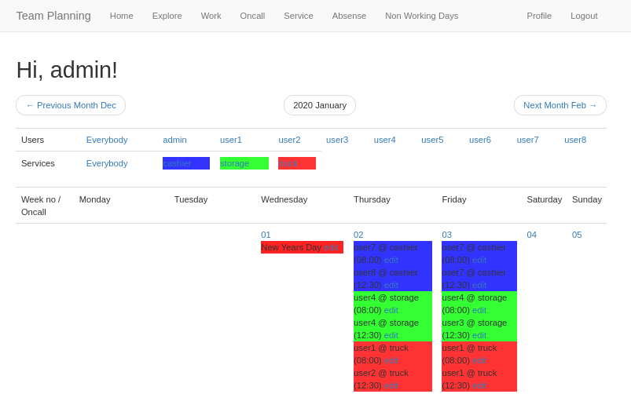
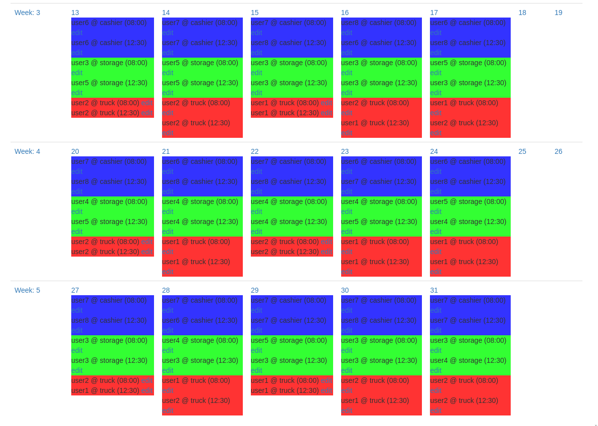
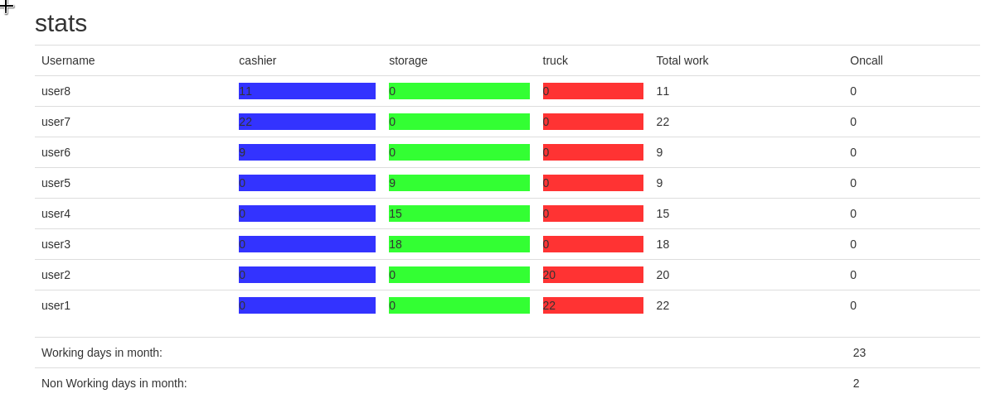
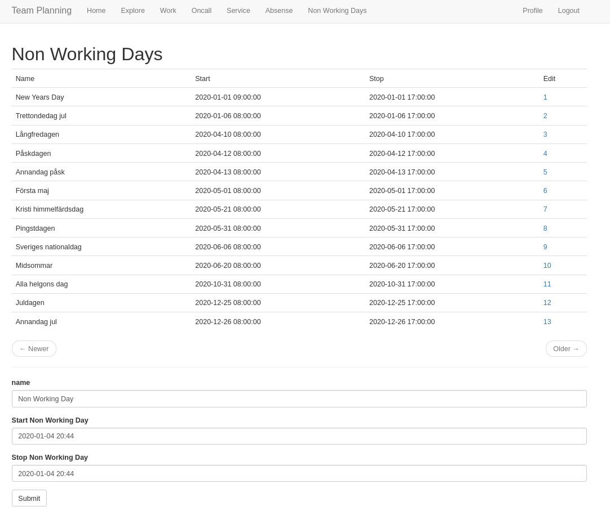

# About

Schema service for multiple teams with on-call planning.

Also can announce new/changes work and on-call to Rocket.Chat

REST API for adding work and users exist, see utils/

Very early version but working software.

Author: https://github.com/henrik-andreasson/

Heavily based on the excellent tutorial  [Flask Mega Tutorial](https://blog.miguelgrinberg.com/post/the-flask-mega-tutorial-part-i-hello-world) by Miguel Grinberg.

Big Thanks to Miguel!

PLANNED feature is ical export (please send pull requests :-)

# pictures

## first page / month view

## On call

## stats 

## Non Working days

## absense

# Run on CentOS

Install python3 and sqlite

    yum install -y python3 sqlite

Used modules

    pip3 install flask-sqlalchemy flask-migrate flask-login flask-mail \
      flask-bootstrap flask-moment flask-babel python-dotenv jwt flask-wtf \
      WTForms-Components flask-httpauth rocketchat_API

install source

    mkdir /opt/teamplan
    cd /opt/teamplan
    unzip teamplan-x.y.z.zip

start
    export FLASK_APP=teamplan.py
    cd /opt/teamplan
    flask run --host=0.0.0.0

See also the systemd service file teamplan.service to run with gunicorn

# Run in Docker

build docker:

    docker build -t teamplan  .

Run bash in docker:

    docker run -p5000:5000 -it  --mount type=bind,source="$(pwd)",target=/teamplan teamplan bash

Run flask

    docker run -p5000:5000 -it  --mount type=bind,source="$(pwd)",target=/teamplan teamplan flask run --host=0.0.0.0 --reload
